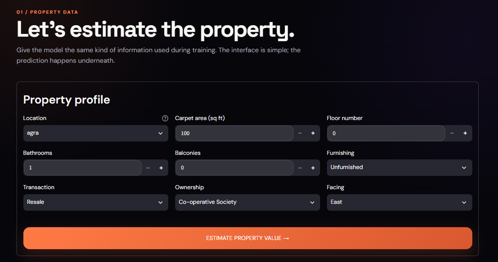
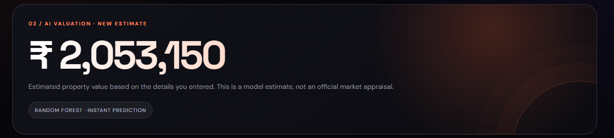

# 🏠 House Price Prediction

An AI-powered House Price Prediction system that uses Machine Learning to estimate the price of residential properties based on their characteristics.

The project uses a trained Machine Learning model and an interactive **Streamlit web application** where users can enter property information and receive an estimated property value.

---

## 📌 Project Overview

House prices depend on several factors such as location, carpet area, floor number, number of bathrooms, balconies, furnishing status, transaction type, ownership, and property facing.

This project applies Machine Learning to learn the relationship between these property features and their prices.

The system allows a user to:

- Enter property details through an interactive web interface.
- Select the property location.
- Enter the carpet area.
- Specify the floor number.
- Select the number of bathrooms and balconies.
- Select furnishing status.
- Select transaction type.
- Select ownership type.
- Select the property facing.
- Receive an estimated house price from the trained Machine Learning model.

---

## 🧠 Machine Learning Model

The project uses a **Random Forest Regressor** for house price prediction.

### Main Features

The model uses the following features:

- Carpet Area (sqft)
- Floor Number
- Bathroom
- Balcony
- Location
- Furnishing
- Transaction
- Ownership
- Facing

The dataset contains approximately **187,000 property listings** from the Indian real-estate market.

During preprocessing, property prices and area values are cleaned and converted into numerical values. Locations with lower frequencies are grouped into an `other` category, while selected categorical features are encoded for Machine Learning.

### Current Model Performance

The original model achieved:

| Metric | Value |
|---|---:|
| MAE | 1,354,452.18 |
| RMSE | 5,705,804.46 |
| R² Score | 0.8260 |

The model is being further improved through preprocessing and Random Forest hyperparameter tuning.

---

## 🌐 Web Application

The project includes an interactive **Streamlit** web application designed to provide a simple and modern interface for house price prediction.

The website allows users to enter the required property information and obtain the predicted property value directly through the browser.

---

## 📸 Screenshots

### 🏠 Home Page


### 📝 Input Predictions



### 💰 The Predictive Value



---

## 🚀 How to Run the Website

### 1. Clone the Repository

```bash
git clone https://github.com/El-adghamF90/House-Price-Prediction.git
```

Then move into the project folder:

```bash
cd House-Price-Prediction
```

### 2. Install the Required Libraries

Make sure Python is installed on your computer.

Install the required dependencies:

```bash
pip install -r requirements.txt
```

If Streamlit is not already installed, install it using:

```bash
pip install streamlit
```

### 3. Run the Streamlit Website

From the **main project folder**, run:

```bash
streamlit run app.py
```

For example, on Windows:

```powershell
cd C:\Users\HP\house-price-project
streamlit run app.py
```

### 4. Open the Website

After running the command, Streamlit will start a local web server.

The terminal will normally display an address similar to:

```text
Local URL: http://localhost:8501
```

Open this address in your web browser:

```text
http://localhost:8501
```

The House Price Prediction website will then be available locally.

> **Note:** The website is now powered by Streamlit. The old FastAPI/React instructions are no longer required to run the web application.

---

## 📊 Dataset

**Dataset:** House Price by Juhi Bhojani

The project uses the [House Price dataset by Juhi Bhojani](https://www.kaggle.com/datasets/juhibhojani/house-price), which contains Indian residential property listings and their corresponding prices.

### Downloading the Dataset

The dataset can be obtained from Kaggle using either of the following methods.

### Option A — Download Manually

1. Open the [House Price dataset by Juhi Bhojani](https://www.kaggle.com/datasets/juhibhojani/house-price).
2. Click **Download** on the dataset page.
3. Unzip the downloaded file.
4. Place the CSV file inside:

```text
notebooks/data/
```

The expected location is:

```text
notebooks/data/house_prices.csv
```

### Option B — Kaggle CLI

Install the Kaggle CLI:

```bash
pip install kaggle
```

Then download and extract the dataset directly into the project:

```bash
kaggle datasets download -d juhibhojani/house-price -p notebooks/data --unzip
```

After downloading, make sure the CSV file is located inside:

```text
notebooks/data/
```

The notebook loads the dataset using:

```python
df = pd.read_csv("data/house_prices.csv")
```

when the notebook is run from the `notebooks/` directory.

---

## 🏡 How to Use the Website

1. Open the Streamlit website.
2. Click **START PREDICTION**.
3. Enter the property information.
4. Select the property location.
5. Enter the carpet area in square feet.
6. Select the floor number.
7. Enter the number of bathrooms.
8. Enter the number of balconies.
9. Select the furnishing status.
10. Select the transaction type.
11. Select the ownership type.
12. Select the property facing.
13. Submit the prediction.
14. The trained Machine Learning model will calculate and display the estimated property value.

---

## 📂 Project Structure

```text
House-Price-Prediction/
│
├── app.py
│
├── backend/
│   ├── app/
│   │   ├── main.py
│   │   ├── preprocessing.py
│   │   └── locations.json
│   │
│   └── models/
│       └── house_price.pkl
│
├── notebooks/
│   ├── data/
│   │   └── house_prices.csv
│   │
│   └── house_price_model.ipynb
│
├── screenshots/
│   ├── Home_Page.png
│   ├── Input_Predictions.png
│   └── The_Predictive_Value.png
│
├── requirements.txt
│
└── README.md
```

---

## 🛠️ Technologies Used

- Python
- Pandas
- NumPy
- Scikit-learn
- Streamlit
- Random Forest
- Jupyter Notebook
- Git & GitHub

---

## 🔄 Machine Learning Workflow

```text
Dataset
   ↓
Data Cleaning
   ↓
Feature Extraction
   ↓
Handling Missing Values
   ↓
Outlier Filtering
   ↓
Feature Engineering
   ↓
Categorical Encoding
   ↓
Train / Test Split
   ↓
Random Forest Regression
   ↓
Model Evaluation
   ↓
Saved Model
   ↓
Streamlit Web Application
   ↓
House Price Prediction
```

---

## 🎯 Project Goal

The main goal of this project is to build a Machine Learning system capable of estimating residential property prices from real-world property information and to make the prediction process accessible through an interactive web application.

---

## 👨‍💻 Author

**Mahmoud El-Adgham**

Electrical & Electronic Engineering | Artificial Intelligence | Machine Learning

GitHub: [El-adghamF90](https://github.com/El-adghamF90)